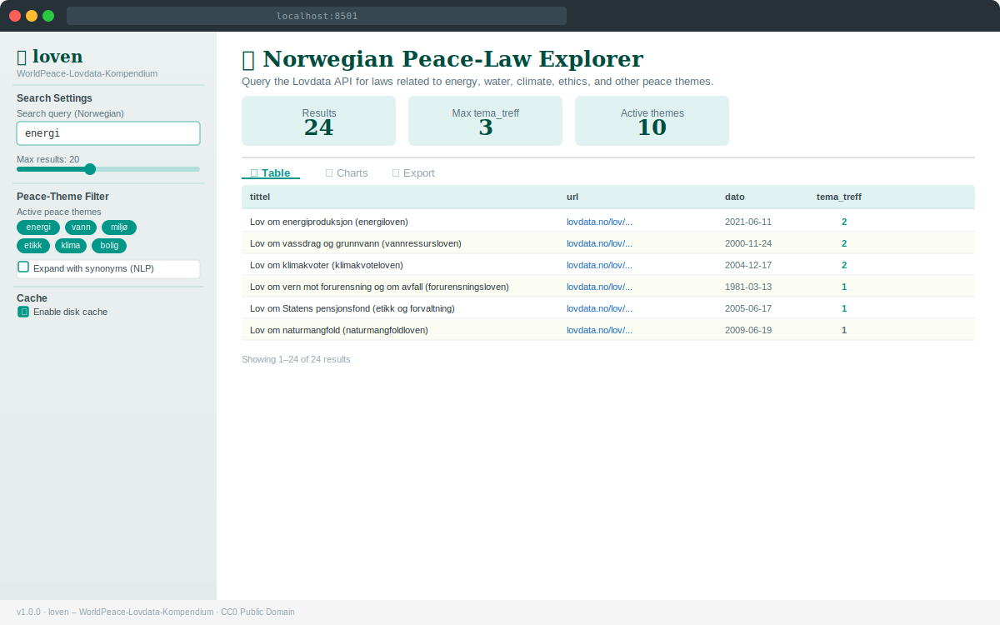
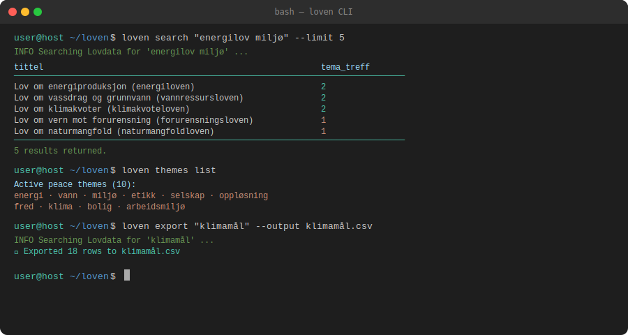

# Screenshots

Visual overview of the **loven** dashboard and command-line interface.

---

## Streamlit Dashboard

The web dashboard provides a search box, theme filters, a results table, charts, and export buttons — all accessible from a browser without any coding.



**Features visible in this screenshot:**

- **Sidebar** — search query input, max-results slider, active peace-theme multi-select, synonym expansion toggle, and cache controls
- **Metrics row** — total results, highest tema_treff score, and number of active themes
- **Results table** — sortable columns: `tittel`, `url`, `dato`, `dokumenttype`, `tema_treff`
- **Tab bar** — switch between Table, Charts, and Export views

Launch the dashboard locally:

```bash
streamlit run app/streamlit_app.py
```

Or with Docker:

```bash
docker compose up
# Open http://localhost:8501
```

---

## CLI

The `loven` command-line interface allows you to search, export, and explore themes directly from the terminal — no browser required.



**Commands shown:**

| Command | Description |
|---|---|
| `loven search "energilov miljø" --limit 5` | Search and print a table of top results |
| `loven themes list` | Display all active peace-theme keywords |
| `loven export "klimamål" --output klimamål.csv` | Search and save results to CSV |

---

## Sample Artifacts

The [`docs/assets/artifacts/`](assets/artifacts/sample_output.csv) directory contains example output files generated by loven:

| File | Description |
|---|---|
| [`sample_output.csv`](assets/artifacts/sample_output.csv) | CSV export of a search for `energilov miljø` |
| [`sample_output.md`](assets/artifacts/sample_output.md) | Markdown export of the same search |

These files demonstrate the structure of loven's output and can be used as reference when processing results programmatically.
